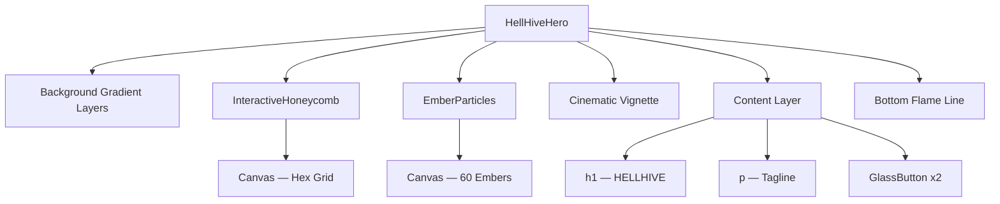

# 🔥 HellHive Hero Section — Complete Replication Guide

This document contains **every single detail** required to build an exact replica of the HellHive hero section, including the interactive honeycomb cursor-tracking effect, floating ember particles, glassmorphism buttons, cinematic gradients, and all supporting configuration.

---

## Table of Contents

1. [Project Setup & Dependencies](#1-project-setup--dependencies)
2. [Configuration Files](#2-configuration-files)
3. [CSS & Design Tokens](#3-css--design-tokens)
4. [Root Layout](#4-root-layout)
5. [Page Entry Point](#5-page-entry-point)
6. [Hero Component — Full Source Code](#6-hero-component--full-source-code)
7. [Architecture Deep-Dive](#7-architecture-deep-dive)
8. [How Each Visual Layer Works](#8-how-each-visual-layer-works)

---

## 1. Project Setup & Dependencies

> [!IMPORTANT]
> This is a **Next.js 16** project using **React 19**, **Tailwind CSS v4**, and **TypeScript**.

### Minimum Required Dependencies (for the hero section only)

```json
{
  "dependencies": {
    "next": "16.1.6",
    "react": "19.2.4",
    "react-dom": "19.2.4",
    "tailwind-merge": "^3.3.1",
    "clsx": "^2.1.1",
    "class-variance-authority": "^0.7.1"
  },
  "devDependencies": {
    "@tailwindcss/postcss": "^4.2.0",
    "postcss": "^8.5",
    "tailwindcss": "^4.2.0",
    "tw-animate-css": "1.3.3",
    "typescript": "5.7.3",
    "@types/node": "^22",
    "@types/react": "19.2.14",
    "@types/react-dom": "19.2.3"
  }
}
```

### Full [package.json](file:///Users/gauravbanik/Desktop/HELL_HIVE/package.json)

```json
{
  "name": "my-project",
  "version": "0.1.0",
  "private": true,
  "scripts": {
    "dev": "next dev",
    "build": "next build",
    "start": "next start",
    "lint": "eslint ."
  },
  "dependencies": {
    "@hookform/resolvers": "^3.9.1",
    "@vercel/analytics": "1.6.1",
    "@radix-ui/react-accordion": "1.2.12",
    "@radix-ui/react-alert-dialog": "1.1.15",
    "@radix-ui/react-aspect-ratio": "1.1.8",
    "@radix-ui/react-avatar": "1.1.11",
    "@radix-ui/react-checkbox": "1.3.3",
    "@radix-ui/react-collapsible": "1.1.12",
    "@radix-ui/react-context-menu": "2.2.16",
    "@radix-ui/react-dialog": "1.1.15",
    "@radix-ui/react-dropdown-menu": "2.1.16",
    "@radix-ui/react-hover-card": "1.1.15",
    "@radix-ui/react-label": "2.1.8",
    "@radix-ui/react-menubar": "1.1.16",
    "@radix-ui/react-navigation-menu": "1.2.14",
    "@radix-ui/react-popover": "1.1.15",
    "@radix-ui/react-progress": "1.1.8",
    "@radix-ui/react-radio-group": "1.3.8",
    "@radix-ui/react-scroll-area": "1.2.10",
    "@radix-ui/react-select": "2.2.6",
    "@radix-ui/react-separator": "1.1.8",
    "@radix-ui/react-slider": "1.3.6",
    "@radix-ui/react-slot": "1.2.4",
    "@radix-ui/react-switch": "1.2.6",
    "@radix-ui/react-tabs": "1.1.13",
    "@radix-ui/react-toast": "1.2.15",
    "@radix-ui/react-toggle": "1.1.10",
    "@radix-ui/react-toggle-group": "1.1.11",
    "@radix-ui/react-tooltip": "1.2.8",
    "autoprefixer": "^10.4.20",
    "class-variance-authority": "^0.7.1",
    "clsx": "^2.1.1",
    "cmdk": "1.1.1",
    "date-fns": "4.1.0",
    "embla-carousel-react": "8.6.0",
    "input-otp": "1.4.2",
    "lucide-react": "^0.564.0",
    "next": "16.1.6",
    "next-themes": "^0.4.6",
    "react": "19.2.4",
    "react-day-picker": "9.13.2",
    "react-dom": "19.2.4",
    "react-hook-form": "^7.54.1",
    "react-resizable-panels": "^2.1.7",
    "recharts": "2.15.0",
    "sonner": "^1.7.1",
    "tailwind-merge": "^3.3.1",
    "vaul": "^1.1.2",
    "zod": "^3.24.1"
  },
  "devDependencies": {
    "@tailwindcss/postcss": "^4.2.0",
    "@types/node": "^22",
    "@types/react": "19.2.14",
    "@types/react-dom": "19.2.3",
    "postcss": "^8.5",
    "shadcn": "^4.0.0",
    "tailwindcss": "^4.2.0",
    "tw-animate-css": "1.3.3",
    "typescript": "5.7.3"
  }
}
```

---

## 2. Configuration Files

### [next.config.mjs](file:///Users/gauravbanik/Desktop/HELL_HIVE/next.config.mjs)

```javascript
/** @type {import('next').NextConfig} */
const nextConfig = {
  typescript: {
    ignoreBuildErrors: true,
  },
  images: {
    unoptimized: true,
  },
}

export default nextConfig
```

### [postcss.config.mjs](file:///Users/gauravbanik/Desktop/HELL_HIVE/postcss.config.mjs)

```javascript
/** @type {import('postcss-load-config').Config} */
const config = {
  plugins: {
    '@tailwindcss/postcss': {},
  },
}

export default config
```

### [tsconfig.json](file:///Users/gauravbanik/Desktop/HELL_HIVE/tsconfig.json)

```json
{
  "compilerOptions": {
    "lib": ["dom", "dom.iterable", "esnext"],
    "allowJs": true,
    "target": "ES6",
    "skipLibCheck": true,
    "strict": true,
    "noEmit": true,
    "esModuleInterop": true,
    "module": "esnext",
    "moduleResolution": "bundler",
    "resolveJsonModule": true,
    "isolatedModules": true,
    "jsx": "react-jsx",
    "incremental": true,
    "plugins": [{ "name": "next" }],
    "paths": {
      "@/*": ["./*"]
    }
  },
  "include": [
    "next-env.d.ts",
    "**/*.ts",
    "**/*.tsx",
    ".next/types/**/*.ts",
    ".next/dev/types/**/*.ts"
  ],
  "exclude": ["node_modules"]
}
```

### [components.json](file:///Users/gauravbanik/Desktop/HELL_HIVE/components.json) (Shadcn UI config)

```json
{
  "$schema": "https://ui.shadcn.com/schema.json",
  "style": "new-york",
  "rsc": true,
  "tsx": true,
  "tailwind": {
    "config": "",
    "css": "app/globals.css",
    "baseColor": "neutral",
    "cssVariables": true,
    "prefix": ""
  },
  "aliases": {
    "components": "@/components",
    "utils": "@/lib/utils",
    "ui": "@/components/ui",
    "lib": "@/lib",
    "hooks": "@/hooks"
  },
  "iconLibrary": "lucide"
}
```

---

## 3. CSS & Design Tokens

> [!IMPORTANT]
> The hero section relies on **6 custom CSS variables** (the `--hive-*` tokens) defined in the `:root` block. These are critical for all gradients and glow effects.

### [app/globals.css](file:///Users/gauravbanik/Desktop/HELL_HIVE/app/globals.css) — Complete File

```css
@import 'tailwindcss';
@import 'tw-animate-css';
@import 'shadcn/tailwind.css';

@custom-variant dark (&:is(.dark *));

:root {
  --background: #0B0B0F;
  --foreground: #F5F5F5;
  --card: #111117;
  --card-foreground: #F5F5F5;
  --popover: #111117;
  --popover-foreground: #F5F5F5;
  --primary: #6A00FF;
  --primary-foreground: #FFFFFF;
  --secondary: #111117;
  --secondary-foreground: #F5F5F5;
  --muted: #1A1A22;
  --muted-foreground: #888888;
  --accent: #FF6A00;
  --accent-foreground: #FFFFFF;
  --destructive: #FF2A2A;
  --destructive-foreground: #FFFFFF;
  --border: #2A2A35;
  --input: #1A1A22;
  --ring: #6A00FF;
  --chart-1: oklch(0.646 0.222 41.116);
  --chart-2: oklch(0.6 0.118 184.704);
  --chart-3: oklch(0.398 0.07 227.392);
  --chart-4: oklch(0.828 0.189 84.429);
  --chart-5: oklch(0.769 0.188 70.08);
  --radius: 0.625rem;
  --sidebar: #111117;
  --sidebar-foreground: #F5F5F5;
  --sidebar-primary: #6A00FF;
  --sidebar-primary-foreground: #FFFFFF;
  --sidebar-accent: #1A1A22;
  --sidebar-accent-foreground: #F5F5F5;
  --sidebar-border: #2A2A35;
  --sidebar-ring: #6A00FF;
  
  /* ======================================================
     HellHive Custom Color Palette — CRITICAL FOR HERO
     ====================================================== */
  --hive-midnight: #0B0B0F;   /* Deep black background */
  --hive-charcoal: #111117;   /* Slightly lighter dark */
  --hive-violet:   #6A00FF;   /* Electric purple for glow */
  --hive-red:      #FF2A2A;   /* Fire red for flame effects */
  --hive-orange:   #FF6A00;   /* Warm orange for accents */
  --hive-gold:     #D4A017;   /* Golden amber for honeycomb */
}

.dark {
  --background: oklch(0.145 0 0);
  --foreground: oklch(0.985 0 0);
  --card: oklch(0.145 0 0);
  --card-foreground: oklch(0.985 0 0);
  --popover: oklch(0.145 0 0);
  --popover-foreground: oklch(0.985 0 0);
  --primary: oklch(0.985 0 0);
  --primary-foreground: oklch(0.205 0 0);
  --secondary: oklch(0.269 0 0);
  --secondary-foreground: oklch(0.985 0 0);
  --muted: oklch(0.269 0 0);
  --muted-foreground: oklch(0.708 0 0);
  --accent: oklch(0.269 0 0);
  --accent-foreground: oklch(0.985 0 0);
  --destructive: oklch(0.396 0.141 25.723);
  --destructive-foreground: oklch(0.637 0.237 25.331);
  --border: oklch(0.269 0 0);
  --input: oklch(0.269 0 0);
  --ring: oklch(0.439 0 0);
  --chart-1: oklch(0.488 0.243 264.376);
  --chart-2: oklch(0.696 0.17 162.48);
  --chart-3: oklch(0.769 0.188 70.08);
  --chart-4: oklch(0.627 0.265 303.9);
  --chart-5: oklch(0.645 0.246 16.439);
  --sidebar: oklch(0.205 0 0);
  --sidebar-foreground: oklch(0.985 0 0);
  --sidebar-primary: oklch(0.488 0.243 264.376);
  --sidebar-primary-foreground: oklch(0.985 0 0);
  --sidebar-accent: oklch(0.269 0 0);
  --sidebar-accent-foreground: oklch(0.985 0 0);
  --sidebar-border: oklch(0.269 0 0);
  --sidebar-ring: oklch(0.439 0 0);
}

@theme inline {
  --font-sans: 'Geist', 'Geist Fallback';
  --font-mono: 'Geist Mono', 'Geist Mono Fallback';
  --color-background: var(--background);
  --color-foreground: var(--foreground);
  --color-card: var(--card);
  --color-card-foreground: var(--card-foreground);
  --color-popover: var(--popover);
  --color-popover-foreground: var(--popover-foreground);
  --color-primary: var(--primary);
  --color-primary-foreground: var(--primary-foreground);
  --color-secondary: var(--secondary);
  --color-secondary-foreground: var(--secondary-foreground);
  --color-muted: var(--muted);
  --color-muted-foreground: var(--muted-foreground);
  --color-accent: var(--accent);
  --color-accent-foreground: var(--accent-foreground);
  --color-destructive: var(--destructive);
  --color-destructive-foreground: var(--destructive-foreground);
  --color-border: var(--border);
  --color-input: var(--input);
  --color-ring: var(--ring);
  --color-chart-1: var(--chart-1);
  --color-chart-2: var(--chart-2);
  --color-chart-3: var(--chart-3);
  --color-chart-4: var(--chart-4);
  --color-chart-5: var(--chart-5);
  --radius-sm: calc(var(--radius) - 4px);
  --radius-md: calc(var(--radius) - 2px);
  --radius-lg: var(--radius);
  --radius-xl: calc(var(--radius) + 4px);
  --color-sidebar: var(--sidebar);
  --color-sidebar-foreground: var(--sidebar-foreground);
  --color-sidebar-primary: var(--sidebar-primary);
  --color-sidebar-primary-foreground: var(--sidebar-primary-foreground);
  --color-sidebar-accent: var(--sidebar-accent);
  --color-sidebar-accent-foreground: var(--sidebar-accent-foreground);
  --color-sidebar-border: var(--sidebar-border);
  --color-sidebar-ring: var(--sidebar-ring);
}

@layer base {
  * {
    @apply border-border outline-ring/50;
  }
  body {
    @apply bg-background text-foreground;
  }
}

/* ============================================
   HellHive Custom Keyframe Animations
   ============================================ */
@keyframes golden-sweep {
  0% {
    transform: translateX(-200%);
    opacity: 0;
  }
  10% {
    opacity: 1;
  }
  90% {
    opacity: 1;
  }
  100% {
    transform: translateX(200%);
    opacity: 0;
  }
}

.animate-golden-sweep {
  animation: golden-sweep 4s ease-in-out infinite;
}
```

### HellHive Color Palette Reference

| Token | Hex | Usage |
|---|---|---|
| `--hive-midnight` | `#0B0B0F` | Primary background, vignette target |
| `--hive-charcoal` | `#111117` | Secondary background, gradient endpoints |
| `--hive-violet` | `#6A00FF` | Title glow, flame gradient, button tint |
| `--hive-red` | `#FF2A2A` | Flame gradients, title text-shadow |
| `--hive-orange` | `#FF6A00` | Flame gradients, bottom line, button tint |
| `--hive-gold` | `#D4A017` | Honeycomb glow, tagline text-shadow |

---

## 4. Root Layout

### [app/layout.tsx](file:///Users/gauravbanik/Desktop/HELL_HIVE/app/layout.tsx)

```tsx
import type { Metadata } from 'next'
import { Geist, Geist_Mono } from 'next/font/google'
import './globals.css'

const _geist = Geist({ subsets: ["latin"] });
const _geistMono = Geist_Mono({ subsets: ["latin"] });

export const metadata: Metadata = {
  title: 'HellHive - Enter The Hive. Burn The Night.',
  description: 'The exclusive underground nightlife event platform. Discover parties, host events, and join the elite nightlife community.',
}

export default function RootLayout({
  children,
}: Readonly<{
  children: React.ReactNode
}>) {
  return (
    <html lang="en">
      <body className="font-sans antialiased">
        {children}
      </body>
    </html>
  )
}
```

> [!NOTE]
> The font `Geist` is loaded via `next/font/google`. It is set as the default sans-serif font through the `@theme inline` block in [globals.css](file:///Users/gauravbanik/Desktop/HELL_HIVE/app/globals.css) (see `--font-sans`).

---

## 5. Page Entry Point

### [app/page.tsx](file:///Users/gauravbanik/Desktop/HELL_HIVE/app/page.tsx) (Hero-Only Version)

```tsx
import HellHiveHero from "@/components/hellhive-hero"

export default function Home() {
  return (
    <main>
      <HellHiveHero />
    </main>
  )
}
```

---

## 6. Hero Component — Full Source Code

### [components/hellhive-hero.tsx](file:///Users/gauravbanik/Desktop/HELL_HIVE/components/hellhive-hero.tsx)

This single file contains **everything** for the hero section: the [InteractiveHoneycomb](file:///Users/gauravbanik/Desktop/HELL_HIVE/components/hellhive-hero.tsx#14-176) canvas, the [EmberParticles](file:///Users/gauravbanik/Desktop/HELL_HIVE/components/hellhive-hero.tsx#177-300) canvas, the [GlassButton](file:///Users/gauravbanik/Desktop/HELL_HIVE/components/hellhive-hero.tsx#301-353) component, and the main [HellHiveHero](file:///Users/gauravbanik/Desktop/HELL_HIVE/components/hellhive-hero.tsx#354-423) export.

```tsx
"use client"

import { useEffect, useRef, useCallback } from "react"

// ============================================================
// TYPE: HexCell — represents one cell in the honeycomb grid
// ============================================================
interface HexCell {
  x: number        // column index
  y: number        // row index
  centerX: number  // pixel X center of the hexagon
  centerY: number  // pixel Y center of the hexagon
  glow: number     // current glow intensity (0–1)
  targetGlow: number // target glow intensity (smoothly interpolated)
}

// ============================================================
// COMPONENT: InteractiveHoneycomb
// A full-screen <canvas> that draws a hexagonal grid.
// Hexagons near the mouse cursor glow golden, with the glow
// spreading to neighboring cells.
// ============================================================
function InteractiveHoneycomb() {
  const canvasRef = useRef<HTMLCanvasElement>(null)
  const hexCellsRef = useRef<HexCell[]>([])
  const mouseRef = useRef({ x: -1000, y: -1000 })
  const animationRef = useRef<number>()

  // Hexagon geometry constants
  const HEX_SIZE = 40                          // radius of each hexagon
  const HEX_WIDTH = HEX_SIZE * 2               // = 80px
  const HEX_HEIGHT = Math.sqrt(3) * HEX_SIZE   // ≈ 69.28px

  // --------------------------------------------------------
  // drawHexagon: renders a single hexagon at (x, y) with
  // a given glow intensity. Uses canvas shadowBlur for the
  // golden glow effect.
  // --------------------------------------------------------
  const drawHexagon = useCallback((ctx: CanvasRenderingContext2D, x: number, y: number, size: number, glow: number) => {
    ctx.beginPath()
    for (let i = 0; i < 6; i++) {
      const angle = (Math.PI / 3) * i - Math.PI / 6
      const hx = x + size * Math.cos(angle)
      const hy = y + size * Math.sin(angle)
      if (i === 0) {
        ctx.moveTo(hx, hy)
      } else {
        ctx.lineTo(hx, hy)
      }
    }
    ctx.closePath()

    // Base subtle stroke
    const baseAlpha = 0.03
    const glowAlpha = glow * 0.6

    if (glow > 0.01) {
      // Glow fill — translucent golden fill
      ctx.fillStyle = `rgba(212, 160, 23, ${glow * 0.15})`
      ctx.fill()

      // Glowing stroke — golden border with canvas shadow glow
      ctx.strokeStyle = `rgba(212, 160, 23, ${baseAlpha + glowAlpha})`
      ctx.lineWidth = 1 + glow * 2
      ctx.shadowColor = "#D4A017"
      ctx.shadowBlur = glow * 20
      ctx.stroke()
      ctx.shadowBlur = 0
    } else {
      // Nearly invisible base stroke when no glow
      ctx.strokeStyle = `rgba(212, 160, 23, ${baseAlpha})`
      ctx.lineWidth = 0.5
      ctx.stroke()
    }
  }, [])

  useEffect(() => {
    const canvas = canvasRef.current
    if (!canvas) return

    const ctx = canvas.getContext("2d")
    if (!ctx) return

    // --------------------------------------------------------
    // resizeCanvas: sets canvas to full viewport and rebuilds
    // the hex grid. Hex rows are staggered (offset on odd rows).
    // --------------------------------------------------------
    const resizeCanvas = () => {
      canvas.width = window.innerWidth
      canvas.height = window.innerHeight

      // Rebuild hex grid
      hexCellsRef.current = []
      const cols = Math.ceil(canvas.width / (HEX_WIDTH * 0.75)) + 2
      const rows = Math.ceil(canvas.height / HEX_HEIGHT) + 2

      for (let row = 0; row < rows; row++) {
        for (let col = 0; col < cols; col++) {
          const offsetX = row % 2 === 0 ? 0 : HEX_WIDTH * 0.375
          const centerX = col * HEX_WIDTH * 0.75 + offsetX
          const centerY = row * HEX_HEIGHT * 0.5

          hexCellsRef.current.push({
            x: col,
            y: row,
            centerX,
            centerY,
            glow: 0,
            targetGlow: 0,
          })
        }
      }
    }

    resizeCanvas()
    window.addEventListener("resize", resizeCanvas)

    // Track mouse position
    const handleMouseMove = (e: MouseEvent) => {
      mouseRef.current = { x: e.clientX, y: e.clientY }
    }

    // Trigger glow on scroll (cells near the scroll position glow subtly)
    const handleScroll = () => {
      const scrollY = window.scrollY
      hexCellsRef.current.forEach((cell) => {
        const distFromTop = Math.abs(cell.centerY - scrollY * 0.5)
        if (distFromTop < 200) {
          cell.targetGlow = Math.max(cell.targetGlow, 0.3 * (1 - distFromTop / 200))
        }
      })
    }

    window.addEventListener("mousemove", handleMouseMove)
    window.addEventListener("scroll", handleScroll)

    // --------------------------------------------------------
    // ANIMATION LOOP
    // Every frame:
    //   1. Calculate distance from each cell to the mouse
    //   2. Set targetGlow based on proximity (150px radius)
    //   3. Smoothly interpolate glow → targetGlow (lerp factor: 0.08)
    //   4. Spread glow to neighboring cells (within 1.2× HEX_WIDTH)
    //   5. Draw each hexagon
    // --------------------------------------------------------
    const animate = () => {
      ctx.clearRect(0, 0, canvas.width, canvas.height)

      const { x: mouseX, y: mouseY } = mouseRef.current
      const GLOW_RADIUS = 150  // pixels — area of influence around cursor

      hexCellsRef.current.forEach((cell) => {
        // Calculate distance from mouse
        const dx = cell.centerX - mouseX
        const dy = cell.centerY - mouseY
        const distance = Math.sqrt(dx * dx + dy * dy)

        // Set target glow based on mouse proximity
        if (distance < GLOW_RADIUS) {
          cell.targetGlow = Math.max(cell.targetGlow, 1 - distance / GLOW_RADIUS)
        } else {
          cell.targetGlow = Math.max(0, cell.targetGlow - 0.02)
        }

        // Smoothly interpolate glow (lerp)
        cell.glow += (cell.targetGlow - cell.glow) * 0.08

        // Spread glow to neighbors
        if (cell.glow > 0.3) {
          hexCellsRef.current.forEach((neighbor) => {
            const ndx = neighbor.centerX - cell.centerX
            const ndy = neighbor.centerY - cell.centerY
            const nDist = Math.sqrt(ndx * ndx + ndy * ndy)
            if (nDist > 0 && nDist < HEX_WIDTH * 1.2) {
              neighbor.targetGlow = Math.max(neighbor.targetGlow, cell.glow * 0.4)
            }
          })
        }

        // Draw the hexagon
        drawHexagon(ctx, cell.centerX, cell.centerY, HEX_SIZE, cell.glow)
      })

      animationRef.current = requestAnimationFrame(animate)
    }

    animate()

    return () => {
      window.removeEventListener("resize", resizeCanvas)
      window.removeEventListener("mousemove", handleMouseMove)
      window.removeEventListener("scroll", handleScroll)
      if (animationRef.current) {
        cancelAnimationFrame(animationRef.current)
      }
    }
  }, [drawHexagon, HEX_HEIGHT, HEX_WIDTH])

  return (
    <canvas
      ref={canvasRef}
      className="absolute inset-0 w-full h-full pointer-events-none"
    />
  )
}

// ============================================================
// COMPONENT: EmberParticles
// Full-screen <canvas> that renders floating fire-like ember
// particles rising from the bottom of the screen.
// ============================================================
function EmberParticles() {
  const canvasRef = useRef<HTMLCanvasElement>(null)
  const animationRef = useRef<number>()

  useEffect(() => {
    const canvas = canvasRef.current
    if (!canvas) return

    const ctx = canvas.getContext("2d")
    if (!ctx) return

    const resizeCanvas = () => {
      canvas.width = window.innerWidth
      canvas.height = window.innerHeight
    }
    resizeCanvas()
    window.addEventListener("resize", resizeCanvas)

    interface Ember {
      x: number
      y: number
      size: number
      speedX: number
      speedY: number
      color: string
      opacity: number
      flickerSpeed: number
      flickerPhase: number
      life: number
      maxLife: number
    }

    const embers: Ember[] = []

    // Ember colors — warm fire tones
    const emberColors = ["#FF6A00", "#FF4500", "#D4A017", "#FF2A2A", "#FFA500"]

    const createEmber = (): Ember => ({
      x: Math.random() * canvas.width,
      y: canvas.height + 20,
      size: Math.random() * 2.5 + 0.5,
      speedX: (Math.random() - 0.5) * 0.8,
      speedY: -(Math.random() * 1.2 + 0.4), // Moving upward
      color: emberColors[Math.floor(Math.random() * emberColors.length)],
      opacity: Math.random() * 0.6 + 0.3,
      flickerSpeed: Math.random() * 0.1 + 0.05,
      flickerPhase: Math.random() * Math.PI * 2,
      life: 0,
      maxLife: Math.random() * 400 + 200,
    })

    // Initialize 60 embers spread across the screen
    for (let i = 0; i < 60; i++) {
      const ember = createEmber()
      ember.y = Math.random() * canvas.height  // random starting Y
      ember.life = Math.random() * ember.maxLife // random starting life
      embers.push(ember)
    }

    const animate = () => {
      ctx.clearRect(0, 0, canvas.width, canvas.height)

      embers.forEach((ember, index) => {
        // Movement: drift horizontally with sine wave + move upward
        ember.x += ember.speedX + Math.sin(ember.life * 0.02) * 0.3
        ember.y += ember.speedY
        ember.life++

        // Flicker effect using sine wave
        const flicker = Math.sin(ember.life * ember.flickerSpeed + ember.flickerPhase) * 0.3 + 0.7
        const currentOpacity = ember.opacity * flicker * (1 - ember.life / ember.maxLife)

        // Reset ember when it dies or goes off screen
        if (ember.life >= ember.maxLife || ember.y < -20) {
          Object.assign(embers[index], createEmber())
        }

        // Draw ember with radial gradient glow
        ctx.save()
        ctx.globalAlpha = currentOpacity

        // Outer glow (4× the ember size)
        const gradient = ctx.createRadialGradient(
          ember.x, ember.y, 0,
          ember.x, ember.y, ember.size * 4
        )
        gradient.addColorStop(0, ember.color)
        gradient.addColorStop(0.5, `${ember.color}40`)
        gradient.addColorStop(1, "transparent")

        ctx.fillStyle = gradient
        ctx.beginPath()
        ctx.arc(ember.x, ember.y, ember.size * 4, 0, Math.PI * 2)
        ctx.fill()

        // Core (solid color, small circle)
        ctx.fillStyle = ember.color
        ctx.beginPath()
        ctx.arc(ember.x, ember.y, ember.size, 0, Math.PI * 2)
        ctx.fill()

        ctx.restore()
      })

      animationRef.current = requestAnimationFrame(animate)
    }

    animate()

    return () => {
      window.removeEventListener("resize", resizeCanvas)
      if (animationRef.current) {
        cancelAnimationFrame(animationRef.current)
      }
    }
  }, [])

  return (
    <canvas
      ref={canvasRef}
      className="absolute inset-0 w-full h-full pointer-events-none"
    />
  )
}

// ============================================================
// COMPONENT: GlassButton
// A frosted-glass styled button with multiple layered effects:
//   - Backdrop blur + subtle white fill
//   - Top edge highlight (1px gradient)
//   - Inner light reflection
//   - Hover light sweep
//   - Violet or orange tint based on variant
// ============================================================
function GlassButton({
  children,
  variant = "primary",
}: {
  children: React.ReactNode
  variant?: "primary" | "secondary"
}) {
  return (
    <button
      className={`
        relative px-8 py-4 rounded-2xl font-semibold text-lg
        backdrop-blur-xl bg-white/[0.08]
        border border-white/[0.12]
        transition-all duration-500 ease-[cubic-bezier(0.23,1,0.32,1)]
        hover:bg-white/[0.14] hover:backdrop-blur-2xl
        hover:border-white/[0.2]
        active:scale-[0.98]
        group overflow-hidden
        ${variant === "secondary" ? "bg-white/[0.06] border-white/[0.1]" : ""}
      `}
      style={{
        boxShadow: "inset 0 1px 0 0 rgba(255,255,255,0.08), 0 2px 8px rgba(0,0,0,0.3)",
      }}
    >
      {/* Top edge highlight - frosted glass reflection */}
      <div className="absolute inset-x-0 top-0 h-px bg-gradient-to-r from-transparent via-white/20 to-transparent" />
      
      {/* Inner light reflection */}
      <div className="absolute inset-0 bg-gradient-to-b from-white/[0.08] to-transparent opacity-60 pointer-events-none" />
      
      {/* Hover light sweep effect */}
      <div 
        className="absolute inset-0 opacity-0 group-hover:opacity-100 transition-opacity duration-700 pointer-events-none"
        style={{
          background: "linear-gradient(105deg, transparent 40%, rgba(255,255,255,0.12) 45%, rgba(255,255,255,0.15) 50%, rgba(255,255,255,0.12) 55%, transparent 60%)",
          animation: "none",
        }}
      />
      
      {/* Subtle violet/orange tint based on variant */}
      <div 
        className={`absolute inset-0 opacity-30 pointer-events-none ${
          variant === "primary" 
            ? "bg-gradient-to-br from-[var(--hive-violet)]/10 via-transparent to-transparent" 
            : "bg-gradient-to-br from-[var(--hive-orange)]/10 via-transparent to-transparent"
        }`}
      />
      
      <span className="relative z-10 text-white/90 group-hover:text-white transition-colors duration-300">{children}</span>
    </button>
  )
}

// ============================================================
// MAIN EXPORT: HellHiveHero
// The complete hero section with all visual layers stacked
// using absolute positioning.
// ============================================================
export default function HellHiveHero() {
  return (
    <section className="relative min-h-screen w-full overflow-hidden bg-[var(--hive-midnight)] flex items-center justify-center">
      {/* LAYER 1: Base gradient background */}
      <div className="absolute inset-0 bg-gradient-to-br from-[var(--hive-charcoal)] via-[var(--hive-midnight)] to-[var(--hive-charcoal)]" />

      {/* LAYER 2: Golden glow from left */}
      <div className="absolute left-0 top-0 h-full w-1/2 bg-gradient-to-r from-[var(--hive-gold)]/10 via-transparent to-transparent" />

      {/* LAYER 3: Violet and red flame gradients (3 elements, staggered pulse) */}
      <div className="absolute bottom-0 left-1/4 h-[60%] w-[40%] bg-gradient-to-t from-[var(--hive-violet)]/20 via-[var(--hive-red)]/10 to-transparent blur-3xl animate-pulse" />
      <div
        className="absolute bottom-0 right-1/4 h-[50%] w-[30%] bg-gradient-to-t from-[var(--hive-red)]/15 via-[var(--hive-orange)]/10 to-transparent blur-3xl animate-pulse"
        style={{ animationDelay: "1s" }}
      />
      <div
        className="absolute top-1/4 right-0 h-[40%] w-[20%] bg-gradient-to-l from-[var(--hive-violet)]/15 to-transparent blur-3xl animate-pulse"
        style={{ animationDelay: "0.5s" }}
      />

      {/* LAYER 4: Interactive honeycomb pattern (canvas) */}
      <InteractiveHoneycomb />

      {/* LAYER 5: Floating ember particles (canvas) */}
      <EmberParticles />

      {/* LAYER 6: Cinematic radial vignette */}
      <div className="absolute inset-0 bg-[radial-gradient(ellipse_at_center,transparent_0%,var(--hive-midnight)_70%)]" />

      {/* LAYER 7: Content (highest z-index) */}
      <div className="relative z-10 flex flex-col items-center justify-center px-4 text-center">
        {/* Main title */}
        <h1
          className="text-6xl sm:text-7xl md:text-8xl lg:text-9xl font-black tracking-[0.2em] text-white mb-6"
          style={{
            textShadow: `
              0 0 40px rgba(106, 0, 255, 0.5),
              0 0 80px rgba(106, 0, 255, 0.3),
              0 0 120px rgba(255, 42, 42, 0.2)
            `,
            fontFamily: "system-ui, sans-serif",
            letterSpacing: "0.15em",
          }}
        >
          HELLHIVE
        </h1>

        {/* Tagline */}
        <p
          className="text-xl sm:text-2xl md:text-3xl text-white/80 font-light tracking-widest mb-12 text-balance"
          style={{
            textShadow: "0 0 20px rgba(212, 160, 23, 0.3)",
          }}
        >
          Enter The Hive. Burn The Night.
        </p>

        {/* Buttons */}
        <div className="flex flex-col sm:flex-row gap-4 sm:gap-6">
          <GlassButton variant="primary">Discover Parties</GlassButton>
          <GlassButton variant="secondary">Host a Party</GlassButton>
        </div>
      </div>

      {/* LAYER 8: Bottom flame gradient line */}
      <div className="absolute bottom-0 left-0 right-0 h-px bg-gradient-to-r from-transparent via-[var(--hive-orange)] to-transparent opacity-50" />
    </section>
  )
}
```

---

## 7. Architecture Deep-Dive

### File Structure (Hero Only)

```
project-root/
├── app/
│   ├── globals.css          ← Design tokens + HellHive custom vars + animations
│   ├── layout.tsx           ← Root layout with Geist font
│   └── page.tsx             ← Imports and renders <HellHiveHero />
├── components/
│   └── hellhive-hero.tsx    ← ALL hero logic in one file (4 components)
├── next.config.mjs          ← Next.js configuration
├── postcss.config.mjs       ← PostCSS with Tailwind plugin
├── tsconfig.json            ← TypeScript configuration
└── package.json             ← Dependencies
```

### Component Hierarchy



### Visual Layer Stack (bottom to top)

| Z-Order | Layer | Type | Description |
|---|---|---|---|
| 1 | Base gradient | `<div>` | Charcoal → midnight → charcoal diagonal gradient |
| 2 | Golden glow | `<div>` | Left-anchored warm gold gradient (10% opacity) |
| 3 | Flame gradients | `<div>` ×3 | Violet/red/orange pulsing blurred gradients |
| 4 | Honeycomb | `<canvas>` | Interactive hex grid with cursor glow |
| 5 | Ember particles | `<canvas>` | 60 floating fire particles |
| 6 | Vignette | `<div>` | Radial gradient darkening edges |
| 7 | Content | `<div>` | Title, tagline, buttons (`z-10`) |
| 8 | Bottom line | `<div>` | 1px orange gradient line |

---

## 8. How Each Visual Layer Works

### 🔷 Interactive Honeycomb — Technical Breakdown

This is the most complex part of the hero. Here's exactly how it works:

#### Grid Generation

- **Hex size**: 40px radius → 80px width, ~69.28px height
- **Layout**: Flat-top hexagons in a staggered grid
- **Stagger**: Odd rows are offset by `HEX_WIDTH × 0.375` (30px)
- **Spacing**: Columns spaced at `HEX_WIDTH × 0.75` (60px), rows at `HEX_HEIGHT × 0.5` (~34.64px)
- **Overflow**: 2 extra rows/columns beyond the viewport for seamless coverage

#### Hexagon Drawing Algorithm

Each hexagon is drawn as a 6-sided polygon:
```
for i in 0..5:
    angle = (π/3) × i − π/6      // flat-top orientation
    vertex = (center + radius × cos(angle), center + radius × sin(angle))
```

#### Glow System

| Parameter | Value | Purpose |
|---|---|---|
| `GLOW_RADIUS` | 150px | Mouse influence radius |
| `baseAlpha` | 0.03 | Nearly invisible base stroke |
| `glowAlpha` | `glow × 0.6` | Bright stroke when glowing |
| Fill color | `rgba(212,160,23, glow×0.15)` | Translucent golden fill |
| Stroke color | `rgba(212,160,23, base+glow)` | Golden border |
| `shadowColor` | `#D4A017` | Canvas shadow for bloom |
| `shadowBlur` | `glow × 20` | Bloom radius (max 20px) |
| Line width | `1 + glow × 2` | Thicker stroke when glowing |
| Lerp factor | 0.08 | Smooth interpolation speed |
| Decay rate | 0.02 per frame | How fast glow fades |
| Neighbor spread | `glow × 0.4` within `1.2 × HEX_WIDTH` | Cascading glow |

#### Mouse Tracking

- `mousemove` event → stores `clientX, clientY` in a ref
- Each frame, every hex cell calculates its Euclidean distance from the mouse
- If distance < 150px → `targetGlow = 1 − (distance / 150)`
- Glow lerps toward target at 8% per frame

#### Glow Spreading

When a cell's glow exceeds 0.3, it checks all other cells within `1.2 × HEX_WIDTH` distance and sets their `targetGlow` to at least `cell.glow × 0.4`. This creates a cascading ripple effect.

---

### 🔶 Ember Particles — Technical Breakdown

| Parameter | Value Range | Notes |
|---|---|---|
| Count | 60 particles | Initialized spread across screen |
| Size | 0.5 – 3.0px | Random |
| Speed X | −0.4 – 0.4 px/frame | Slight horizontal drift |
| Speed Y | −0.4 – −1.6 px/frame | Upward movement |
| Horizontal wave | `sin(life × 0.02) × 0.3` | Sinusoidal drift |
| Life span | 200 – 600 frames | ~3–10 seconds |
| Flicker | `sin(life × flickerSpeed + phase) × 0.3 + 0.7` | Brightness oscillation |
| Opacity fade | Linearly fades to 0 over lifetime | `1 − life/maxLife` |
| Colors | `#FF6A00`, `#FF4500`, `#D4A017`, `#FF2A2A`, `#FFA500` | Warm fire tones |
| Glow radius | `size × 4` | Radial gradient for soft glow |

Each ember has two visual layers:
1. **Outer glow**: Radial gradient from solid color → 25% opacity → transparent
2. **Core**: Solid color circle at the ember's actual size

---

### 🟣 Title Text-Shadow

The "HELLHIVE" title uses a **triple-layered text-shadow** for a neon glow effect:

```
0 0 40px  rgba(106, 0, 255, 0.5)   ← tight violet glow
0 0 80px  rgba(106, 0, 255, 0.3)   ← medium violet spread
0 0 120px rgba(255, 42, 42, 0.2)   ← wide red halo
```

Font: `system-ui, sans-serif` at `font-weight: 900` (`font-black`), with `letter-spacing: 0.15em`.

Responsive sizing:
- Mobile: `text-6xl` (3.75rem)
- `sm`: `text-7xl` (4.5rem)
- [md](file:///Users/gauravbanik/Desktop/HELL_HIVE/README.md): `text-8xl` (6rem)
- `lg`: `text-9xl` (8rem)

---

### 🟡 Tagline Text-Shadow

```
0 0 20px rgba(212, 160, 23, 0.3)   ← subtle golden glow
```

---

### 🔵 GlassButton Layers

Each button has **5 visual layers** stacked with absolute positioning:

| Layer | CSS | Purpose |
|---|---|---|
| Base | `backdrop-blur-xl bg-white/[0.08]` | Frosted glass effect |
| Top highlight | `h-px via-white/20` | Thin light reflection at top edge |
| Inner reflection | `from-white/[0.08] to-transparent` | Top-down gradient light |
| Hover sweep | 105° diagonal gradient | Light sweep on hover |
| Color tint | `from-[var(--hive-violet)]/10` or `from-[var(--hive-orange)]/10` | Subtle color accent |

Additional styling:
- `boxShadow`: Inset top highlight + outer shadow
- Transition: 500ms with `cubic-bezier(0.23, 1, 0.32, 1)` easing
- Active state: `scale(0.98)`

---

### 🟤 Cinematic Vignette

A single `<div>` with a radial gradient:
```css
background: radial-gradient(ellipse at center, transparent 0%, #0B0B0F 70%);
```
This darkens the edges of the viewport, creating a cinematic frame that focuses attention on the center content.

---

### 🟠 Flame Gradients

Three absolutely-positioned `<div>` elements with `blur-3xl` and `animate-pulse`:

| Flame | Position | Size | Colors | Delay |
|---|---|---|---|---|
| 1 | `bottom-0 left-1/4` | `h-[60%] w-[40%]` | violet/20 → red/10 → transparent | 0s |
| 2 | `bottom-0 right-1/4` | `h-[50%] w-[30%]` | red/15 → orange/10 → transparent | 1s |
| 3 | `top-1/4 right-0` | `h-[40%] w-[20%]` | violet/15 → transparent | 0.5s |

The staggered `animationDelay` creates an organic, breathing fire effect.

---

> [!TIP]
> **To replicate this in a fresh project:**
> 1. Create a new Next.js 16 project
> 2. Copy [globals.css](file:///Users/gauravbanik/Desktop/HELL_HIVE/app/globals.css) with the `--hive-*` variables and the `golden-sweep` keyframe
> 3. Copy [layout.tsx](file:///Users/gauravbanik/Desktop/HELL_HIVE/app/layout.tsx) with the Geist font import
> 4. Copy the entire [hellhive-hero.tsx](file:///Users/gauravbanik/Desktop/HELL_HIVE/components/hellhive-hero.tsx) file
> 5. Import and render `<HellHiveHero />` in your page
> 6. Install deps: `next`, `react`, `react-dom`, `tailwindcss@^4.2`, `@tailwindcss/postcss`, `tw-animate-css`
> 7. Run `npm run dev` — done!
